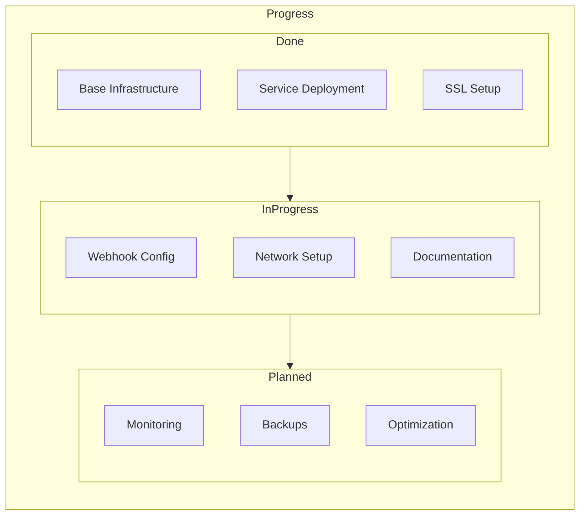

# Progress Tracking

## What Works

### 1. Core Infrastructure
- [x] Docker Compose setup
- [x] Volume persistence
- [x] Basic service deployment
- [x] SSL/TLS with Caddy

### 2. Services
- [x] n8n base functionality
- [x] Ollama LLM hosting
- [x] Flowise AI workflows
- [x] SearxNG search
- [x] Langfuse analytics
- [x] Open WebUI interface
- [x] Redis caching
- [x] PostgreSQL database

### 3. Networking
- [x] External domain access
- [x] Basic reverse proxy
- [x] Port forwarding setup
- [x] HTTPS encryption

## What's Left to Build

### 1. High Priority
- [ ] Fix Telegram webhook connectivity
  - [ ] Container DNS resolution
  - [ ] Websocket support
  - [ ] Connection stability

### 2. Medium Priority
- [ ] Docker network optimization
  - [ ] Explicit network configuration
  - [ ] Service discovery improvement
  - [ ] Connection pooling setup

### 3. Future Enhancements
- [ ] Automated backup system
- [ ] Monitoring dashboard
- [ ] Resource usage optimization
- [ ] Documentation improvements

## Current Status

### Active Development

### Implementation Status
| Component | Status | Notes |
|-----------|--------|-------|
| Base Infrastructure | ✅ Complete | Docker Compose working |
| Service Deployment | ✅ Complete | All services running |
| SSL/TLS | ✅ Complete | Caddy auto-HTTPS working |
| Webhook Support | 🔄 In Progress | DNS resolution issues |
| Network Config | 🔄 In Progress | Need explicit setup |
| Documentation | 🔄 In Progress | Being updated |
| Monitoring | 📅 Planned | Future enhancement |
| Backup System | 📅 Planned | To be implemented |

## Known Issues

### 1. Critical
- DNS resolution failing between containers
- Telegram webhook connection unstable
- Websocket connections not maintaining

### 2. Non-Critical
- Documentation needs updating
- Network configuration could be optimized
- Resource usage monitoring needed

## Next Milestones

### 1. Immediate (Next 24 Hours)
- [ ] Resolve DNS issues
- [ ] Fix webhook connectivity
- [ ] Update documentation

### 2. Short Term (Next Week)
- [ ] Implement monitoring
- [ ] Optimize networking
- [ ] Add backup system

### 3. Long Term (Next Month)
- [ ] Performance optimization
- [ ] Resource usage dashboard
- [ ] Automated testing

## Recent Updates
- Added websocket header configuration
- Updated Caddy reverse proxy settings
- Modified container networking approach
- Documented current issues and status
