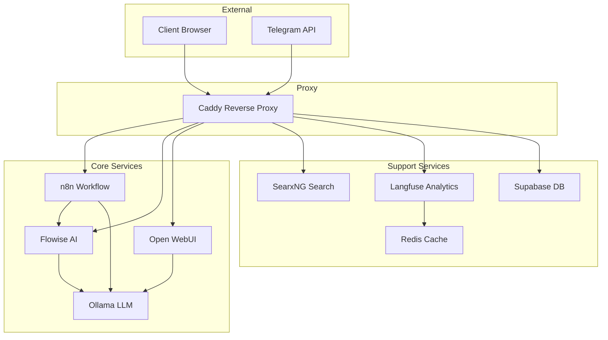
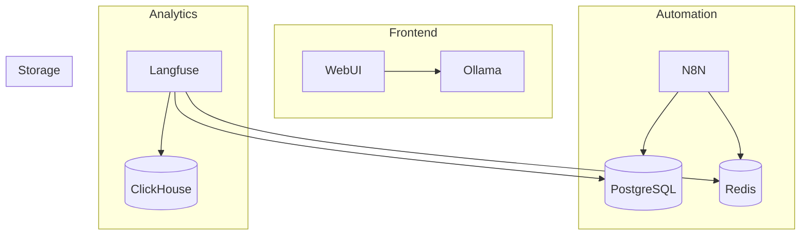

# System Patterns

## System Architecture

### 1. Container Architecture

## Key Technical Decisions

### 1. Service Configuration
- **Caddy as Reverse Proxy**
  - Automatic HTTPS handling
  - Websocket support
  - Port forwarding (8443 external → 9443 internal)

- **n8n for Workflow Automation**
  - PostgreSQL database backend
  - Webhook integration capability
  - Custom workflow import support

- **Ollama for LLM**
  - Local model hosting
  - Multiple model support
  - CPU/GPU configuration options

### 2. Container Management
- **Volume Strategy**
  - Named volumes for persistence
  - Separate volumes per service
  - Backup capability

- **Networking**
  - Internal container communication
  - External port mapping
  - Service discovery

### 3. Resource Management
- **Memory Allocation**
  - GOMEMLIMIT settings
  - Redis caching
  - Connection pooling

## Design Patterns

### 1. Service Patterns
- **Microservices Architecture**
  - Independent service scaling
  - Loose coupling
  - Service-specific configurations

- **Proxy Pattern**
  - Caddy as central entry point
  - Request routing
  - SSL termination

- **Observer Pattern**
  - Webhook implementations
  - Event-driven workflows
  - Real-time updates

### 2. Data Patterns
- **Data Persistence**
  - Volume mapping
  - Database connections
  - Cache management

- **State Management**
  - Redis for caching
  - PostgreSQL for persistence
  - Volume-based storage

### 3. Integration Patterns
- **API Gateway**
  - Centralized access control
  - Request routing
  - Protocol translation

- **Message Queue**
  - Asynchronous processing
  - Event handling
  - Task distribution

## Component Relationships

### 1. Service Dependencies

### 2. Data Flow
- Client requests → Caddy
- Caddy → Appropriate service
- Service → Database/Cache
- Service → Client response

### 3. Security Patterns
- TLS termination at Caddy
- Internal network isolation
- Environment-based configuration
- Container capability restrictions
