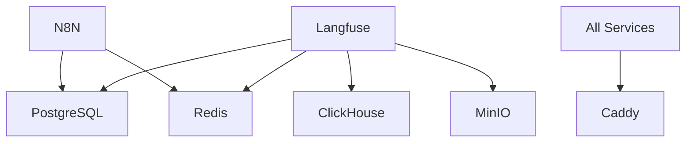

# Technical Context

## Technologies Used

### Core Services

1. **n8n**
   - Version: Latest
   - Purpose: Workflow Automation
   - Dependencies:
     - PostgreSQL database
     - Redis for caching
   - Configuration:
     - Port: 5678 (internal)
     - Custom workflow imports enabled
     - Task runners support (currently disabled)

2. **Caddy**
   - Version: 2-alpine
   - Purpose: Reverse Proxy
   - Features:
     - Automatic HTTPS
     - HTTP/2 and HTTP/3 support
     - Websocket proxying
   - Ports:
     - 9080: HTTP
     - 9443: HTTPS

3. **Ollama**
   - Version: Latest
   - Purpose: LLM Hosting
   - Features:
     - CPU/GPU support
     - Multiple model support
   - Models:
     - qwen2.5:7b-instruct-q4_K_M
     - nomic-embed-text
   - Context Length: 8192

4. **Flowise**
   - Version: Latest
   - Purpose: AI Workflow Creation
   - Port: 3001
   - Features:
     - Custom tool integration
     - n8n integration

### Support Services

1. **SearxNG**
   - Version: Latest
   - Purpose: Privacy-focused Search
   - Port: 8083 (internal)
   - Features:
     - HTTP compression (zstd, gzip)
     - Content security policy
     - Cache control

2. **Langfuse**
   - Version: 3
   - Components:
     - Web UI (port 3005)
     - Worker
     - ClickHouse
     - MinIO

3. **Redis (Valkey)**
   - Version: 8-alpine
   - Purpose: Caching/State Management
   - Features:
     - Persistence enabled
     - Limited logging
     - Health checks

4. **PostgreSQL**
   - Latest version
   - Purpose: Primary Database
   - Ports: 5433 (host)

## Development Setup

### Environment Configuration
```env
LETSENCRYPT_EMAIL=
N8N_HOSTNAME=
WEBUI_HOSTNAME=
FLOWISE_HOSTNAME=
LANGFUSE_HOSTNAME=
OLLAMA_HOSTNAME=
SUPABASE_HOSTNAME=
SEARXNG_HOSTNAME=
POSTGRES_PASSWORD=
N8N_ENCRYPTION_KEY=
N8N_USER_MANAGEMENT_JWT_SECRET=
```

### Volume Structure
- n8n_storage
- ollama_storage
- qdrant_storage
- open-webui
- flowise
- caddy-data
- caddy-config
- valkey-data
- langfuse_postgres_data
- langfuse_clickhouse_data
- langfuse_clickhouse_logs
- langfuse_minio_data

## Technical Constraints

### 1. Networking
- Internal ports must not conflict
- External port forwarding (8443 → 9443)
- DNS resolution between containers
- Websocket support requirements

### 2. Resource Management
- Memory limits for Go services
- GPU access for Ollama (optional)
- Disk space for persistent volumes
- Connection pooling limits

### 3. Security
- Container capability restrictions
- TLS certificate management
- Environment variable protection
- Network isolation

### 4. Performance
- Cache settings per service
- Database connection limits
- Proxy buffering settings
- Compression configurations

## Dependencies

### Direct Dependencies


### External Dependencies
- Docker Engine
- Docker Compose
- NVIDIA drivers (for GPU support)
- Let's Encrypt (for SSL)
